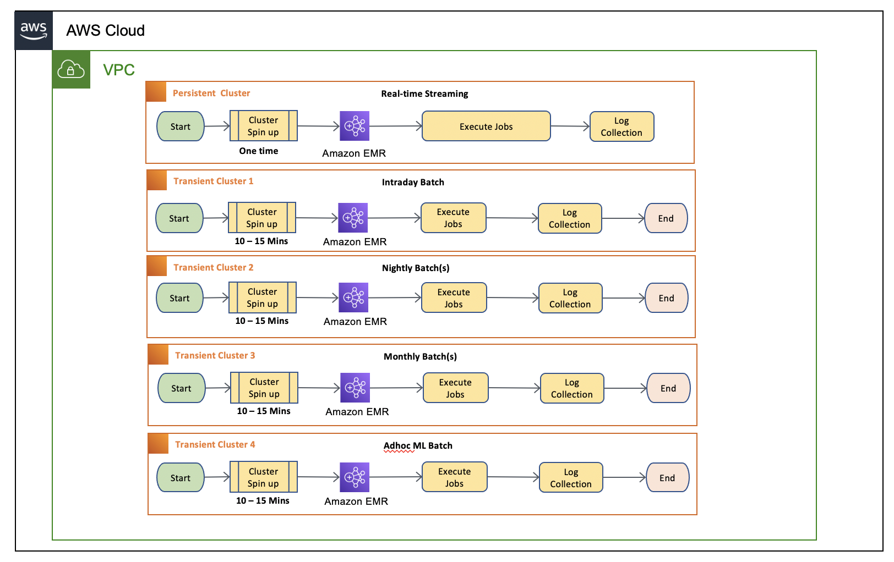
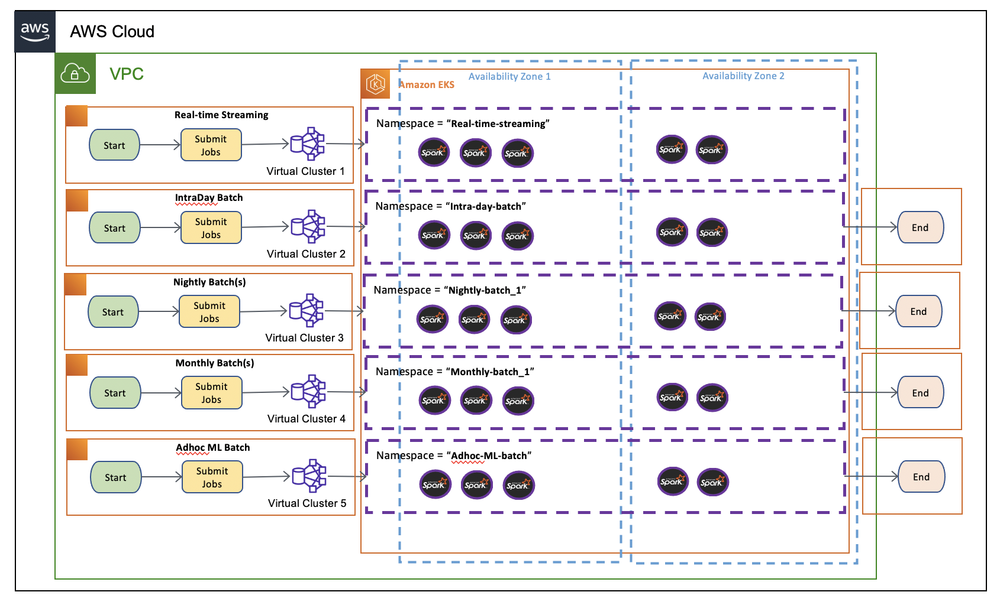

## EMR on EKS for Transient EMR Clusters


Diagram 1.1 – Current batch design with EMR on Ec2 transient cluster



Diagram 1.2 – proposed batch design with EMR on EKS.

# Prerequisites
Before you build the entire infrastructure, you must meet the following prerequisites.
*	An AWS Account with valid AWS credentials
*	[AWS Command Line Interface (CLI)](https://docs.aws.amazon.com/cli/latest/userguide/getting-started-install.html) 
*	[kubectl – Kubernetes CLI](https://kubernetes.io/docs/tasks/tools/install-kubectl-linux/)
*	[eksctl - Installation](https://docs.aws.amazon.com/eks/latest/userguide/eksctl.html)
*	[helm](https://helm.sh/)
# Deployment
Let’s deploy the solution.
### Step 1: Clone the repo
Open your Terminal window, change to home directory, and clone the repo.

```console
cd ~ 
git clone https://github.com/ajeebpeter/EMR-On-EKS-Transient-Clusters.git
````
Then, navigate to

```console
cd EMR-On-EKS-Transient-Clusters
```
Note: This folder contains a set of shell script files (.sh) and output files (.txt) with matching names.  You can execute the script files as instructed on the below steps. And can verify the outcome with corresponding output file.

### Step 2: Initialize the environment variables


```console
# Environment variables required used in scripts

export CLUSTER_NAME="eks-emr-cluster"
export AWS_ACCOUNT_ID="$(aws sts get-caller-identity --query Account --output text)"
export AWS_REGION="us-east-2" # Enter your region
export MY_EKSCONSOLE_ROLE="<Your IAM User Role>" # Enter your IAM User Role

# Alias for kubectl
alias k=kubectl
```
### Step 3: Create the EKS Cluster


Create an EKS cluster with 1 node configuration which can expand up-to 10 nodes. This will be the single shared computer platform for spark jobs.

EKS Cluster creation can be done in multiple ways like [eksctl](https://eksctl.io/), [CDK](https://aws.amazon.com/blogs/containers/introducing-cdk-for-kubernetes/) , [HashiCorp Terraform](https://www.terraform.io/)  etc. AWS recently announced open-source project called[EKS Blueprints](https://aws.amazon.com/blogs/containers/bootstrapping-clusters-with-eks-blueprints/). EKS Blueprints is implemented in two popular IaC frameworks, [HashiCorp Terraform](https://www.terraform.io/) and [AWS Cloud Development Kit (AWS CDK)](https://aws.amazon.com/cdk/), which help you automate infrastructure deployments.

In this blog we are creating the cluster with the eksctl.

Linux
```console
sh 1-eks-cluster-creation-script.sh
```
### Step 4: Verify the EKS Cluster

Please note that EKS cluster creation will take 10-15 minutes. 
Go to the (EKS console)[https://console.aws.amazon.com/eks/home] and EKS Service, and select the clusters link. You should see the EKS cluster in Active state as shown in the following image. 


### Step 5: Create EMR Virtual Clusters

In this step we are creating namespaces for each virtual cluster to provide the complete isolation (both resource consumption and visibility) in EKS level.  Then we create the virtual cluster for each job category. Additionally, we also provide service level access to EMR for using the EKS resources on each namespace.


```console
sh 2-virtual-cluster-creation.sh
```
### Step 6: Verify the EMR Virtual Clusters

By this time, you should be able to verify the virtual cluster created in in EMR  by navigating to the “Virtual clusters” at (EMR console)[https://console.aws.amazon.com/elasticmapreduce/home].


### Step 7: Create job execution roles and permissions.

In this step we will create job execution roles for each virtual cluster with defined access policies for s3 and CloudWatch.


```console
sh 3-iam-roles-and-permissions.sh
```
### Step 8: Logging setup (CloudWatch and S3)

EMR on EKS natively support logging options with S3 (For Long term log retension)  and CloudWatch (for shorterm analysis and event triggers). In this step we are going to setup CloudWatch log group and also an S3 bucket for each virtual cluster.

CloudWatch Log Groups

  

S3 Logs 

  

```console
sh 4-logs-location-s3-and-cloudwatch.sh
```

CloudWatch log groups	 


S3 buckets


### Step 9: Submit a spark Job

While submitting an EMR Saprk job, EMR on EKS will convert those to EKS specific component like Jobs and Pods. An EMR job translates to 3 EKS components under the hood.
- A controller job which creates a job runner pod - Equivalent to spark job
- A driver pod - Equivalent to spark driver
- And a set of executor pods - Equivalent to spark executors

In the following example we are submitting a sample spark job to virtual cluster “monthly-batch-emr-cluster”.


```console
sh 5-simple-job-submission.sh
```
### Step 10: Verify the Job Status.

The EMR job status can be verified at EMR console by navigating to virtual cluster “monthly-batch”.


Behind the scene at EKS will create one job which orchestrates a set pods like Controller, driver and executors. You can see the pod lifecycle during the job execution.


### Step 11: Verify the logs.

The logs can be verifying by 3 different ways. Spark history server on EMR, CloudWatch and S3.

1.	Spark history server - Navigate to virtual cluster “monthly-batch” and Click on the “view logs” of the job submitted. And drill down on each task level.


2.	CloudWatch Logs (Logs based metric and event automation)


3.	And S3 (For long term retention)
Navigate to bucket named - monthly-batch-logs-[YOUR ACCOUNT ID]-[YOUR AWS REGION]. The logs will be saved with job ID and you can drill down all the way stderr & stdout.


 
 

### Step 12: Cluster Monitoring with CloudWatch Container Insights.

In this step we are setting up CloudWatch agents on each node as daemons sets and provide necessary permissions. We are installing 2 applications as part of this with the help of [Helm](https://helm.sh/) (A Kubernetes application manager).
•	Deploy CloudWatch-Agent - (sending the metrics to CloudWatch) as a Daemon Set.
•	Deploy fluentd - (sending the logs to CloudWatch) as a Daemon Set.


```console
sh 6-cloudwatch-container-insights.sh
```

### Step 13: Verify the application and cluster health.
Now let’s navigate back to CloudWatch Container Insights browser tab to view the data we’ve generated. Select Performance Monitoring and select the EKS cluster. 
Please note: It may take few minutes for CloudWatch Container Insights to retrieve metrics from the cluster and populate the associated dashboard.
 
  

### Step 14: Priority Classes.

In this Step we will create 4 different pod priority classes with a priority value ranging from 100 to 400. Where highest number (in our case 400) is the highest priority. 


```console
sh 7-pod-priority-classes.sh 
kubectl get PriorityClass
```


### Step 15: Pod Templates.

One of the key considerations while templatizing the driver pods, especially for low priority jobs is to avoid the same low priority class for both driver and executor.  This will save the driver pods from getting evicted and lose the progress of all its executors in a resource congestion scenario. In this low priority job example, we have used a high priority class for driver pod templates and low priority classes only for executor templates. That way we can ensure the driver pods are safe during the eviction process of low priority jobs. In this case only executors will be evicted and the driver can bring back the evicted executor pods as the resource becomes freed.

In this step we create s3 folder to keep all our templates and later create an save the pod templates file which later use during the job submission.


```console
sh 8-pod-templates.sh
```
### Step 16: Submit a spark Jobs with pod template – Priority based job handling.

In this step we will submit 2 jobs, one high priority and other one low priority. We will assign corresponding job templates each for driver and executors, which has right assignment priority classes. You will see the high priority job will started and completed before the low priority jobs. You can also mimic a scenario of suspending a half-executed job while a high priority job being submitted and later the low priority job resumes immediately after the high priority job completed.

Remember these scenarios will make sense only during the resource congestion. In this post, our jobs are exhausting all the 4 vCPUs of our cluster with single node.

In this step we are submitting the low priority job to monthly cluster and a high priority job to intra-day cluster. Let’s submit the low priority job first which will take closely 6 minutes to finish with 2 executors. This job consumes most of the CPU resources and we can monitor it’s in the CloudWatch Container Insights. After 1 minute, we can submit the high priority job to intra-day cluster.


```console
sh 9-monthly-batch-low-priority-job.sh
``` 
Wait for a minute, to start the executors of the job. That way we can see how it handles the priorities without affecting the existing jobs.


```console
sh 10-intra-day-high-priority-time-sensitive-job.sh
```
### Step 17: Verify what happened.

Let’s look at what happened our jobs.

The top image is for the first job submitted, the low priority monthly batch job and the bottom one is intraday high priority job. Both job has 2 executors. As you could see the low priority job’s executor #2 got removed due resource constraint immediately after the submission of intraday job. And the executor added back as executor #3 once the intraday job got finished. 


Navigate to Container insight and performance monitoring. And then select “EKS Nodes” on below select box. You could see the “Reserved CPU” reached its threshold. Which triggered the low priority job evictions.


### Step 18: Autoscaling with Karpenter - setup.

In this step we will setup the access components needed for karpenter including IAM roles and service accounts. Later we will install the karpenter using helm. At the end we create a default provisioner with scaling constraints.


```console
sh 11-karpenter-setup.sh
```

### Step 19: Kubernetes Resource View in Amazon EKS console

[Amazon Elastic Kubernetes Service (Amazon EKS)](https://aws.amazon.com/eks/) now allows you to see all standard Kubernetes API resource types running on your Amazon EKS cluster using the [AWS Management Console](https://aws.amazon.com/console/). This makes it easy to visualize and troubleshoot your Kubernetes applications using Amazon EKS. The updated Amazon EKS console now includes all standard Kubernetes API resource types such as service resources, configuration and storage resources, authorization resources, policy resources and more.

To learn more, read our [blog](https://aws.amazon.com/blogs/containers/introducing-kubernetes-resource-view-in-amazon-eks-console/) or visit the [AWS documentation](https://docs.aws.amazon.com/eks/latest/userguide/view-kubernetes-resources.html).

In this step we create roles and role bindings and attach it with console user IAM role.

```console
sh 12-eks-console-view-resources.sh
```
### Step 20: Verify the cluster Nodes via EKS console.

Navigate to EKS cluster and click on the “resources” tab, where you will see all resources including workloads and native resources. Expand the “Cluster” and clock on nodes. At this point we have one node of type m5.2xlarge. 


### Step 21: Autoscaling in Action by Karpenter.

In this step we will stress the cluster with 2 jobs in parallel and see how Karpenter handles the node scaling. 


```console
sh 9-monthly-batch-low-priority-job.sh
sh 10-intra-day-high-priority-time-sensitive-job.sh
```

After submitting the job, you could see the karpenter requesting for additional capacity. 


 

Finally, you could see an expanded cluster. And please note the instance types can be different from what we had initially. Karpenter identify the required capacity and provision appropriate node types by directly working with ec2 fleet APIs. In our example the additional capacity being provided by spot instances which provides additional cost savings.


Notice the time of the parameter “ttlSecondsAfterEmpty=30” as part of carpenter provisioner. This means once the load on the server become empty. It will terminate within 30 Seconds. 


The cluster scaled down and back its original state.


### Step 22: Clean up

Finally let’s cleanup to avoid unwanted cost of provisioned resources.


```console
sh 101-cleanup-script.sh
```


## Security

See [CONTRIBUTING](CONTRIBUTING.md#security-issue-notifications) for more information.

## License

This project is licensed under the Apache-2.0 License.

